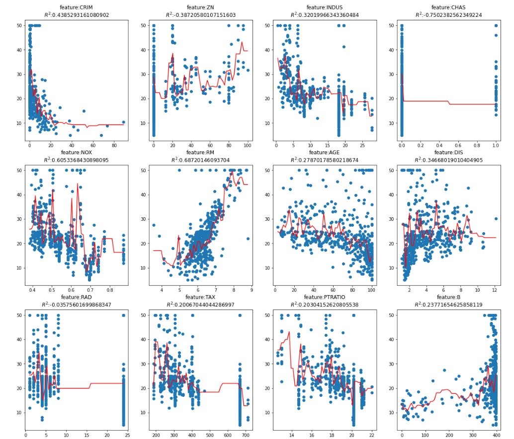
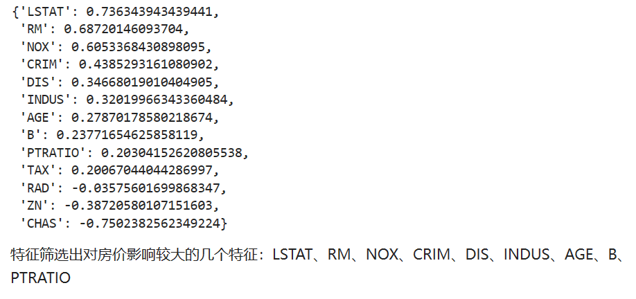

# 机器学习经典算法练习-波士顿房价预测

#### 介绍
通过波士顿房价数据集，展示如何应用经典机器学习算法进行房价预测。包含数据处理、模型训练与评估等步骤，助力你掌握机器学习实战技能。

1. 数据集特征说明：共有506行数据13个特征和1个标签。

> CRIM：城镇人均犯罪率。
>
> ZN：住宅用地超过 25000 sq.ft. 的比例。
>
> INDUS：城镇非零售商用土地的比例。
>
> CHAS：查理斯河空变量（如果边界是河流，则为1；否则为0）。
>
> NOX：一氧化氮浓度。
>
> RM：住宅平均房间数。
>
> AGE：1940 年之前建成的自用房屋比例。
>
> DIS：到波士顿五个中心区域的加权距离。
>
> RAD：辐射性公路的接近指数。
>
> TAX：每 10000 美元的全值财产税率。
>
> PTRATIO：城镇师生比例。
>
> B：1000（Bk-0.63）^ 2，其中 Bk 指代城镇中黑人的比例。
>
> LSTAT：人口中地位低下者的比例。
>
> MEDV：自住房的平均房价，以千美元计。

2. 特征筛选

#### 安装教程

1.  pip install jupyter
2.  pip install numpy pandas matplotlib
3.  pip install scikit-learn

#### 使用说明

1.  数据集在dataset中
2.  找到source_code文件夹，在此路径中运行jupyter notebook就行

